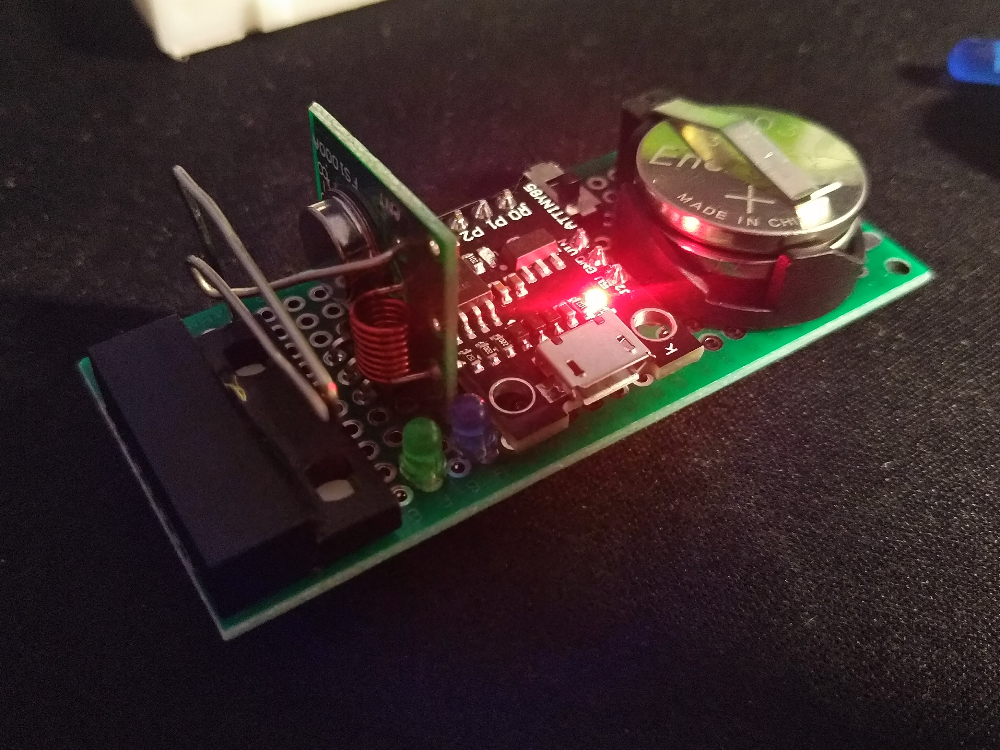
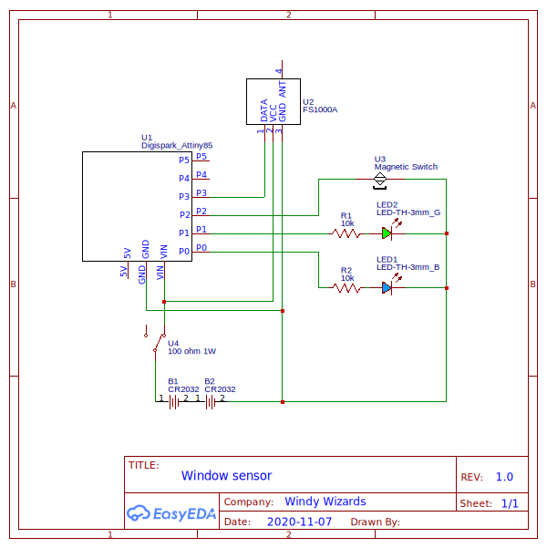

# Windy Wizard

Ventilating your flat is not as easy as it may seem. Keep windows closed - you will get sick. Keep them open all the time - you will pay for heating. Windy Wizard helps you to keep air in your flat healthy and your bills low.

System parts are:
1. Main computer controlling sensors around house (see `rpi/`)
2. Window sensors (see `sensor/`)

## Main computer
Main computer oversees all the sensors around the house. It is a Raspberry Pi device with a screen and radio receiver for 433 MHz. Device displays state of sensors and reminds you to let some fresh air in.

## Window sensors
Window sensor is a simple device with unique ID which communicates window has been opened/closed. It also sends alive message to keep system informed about device state. Device is powered from battery, and sends updates over 433 MHz radio frequency.

Device on prototyping board:

    

Schematic:

    

